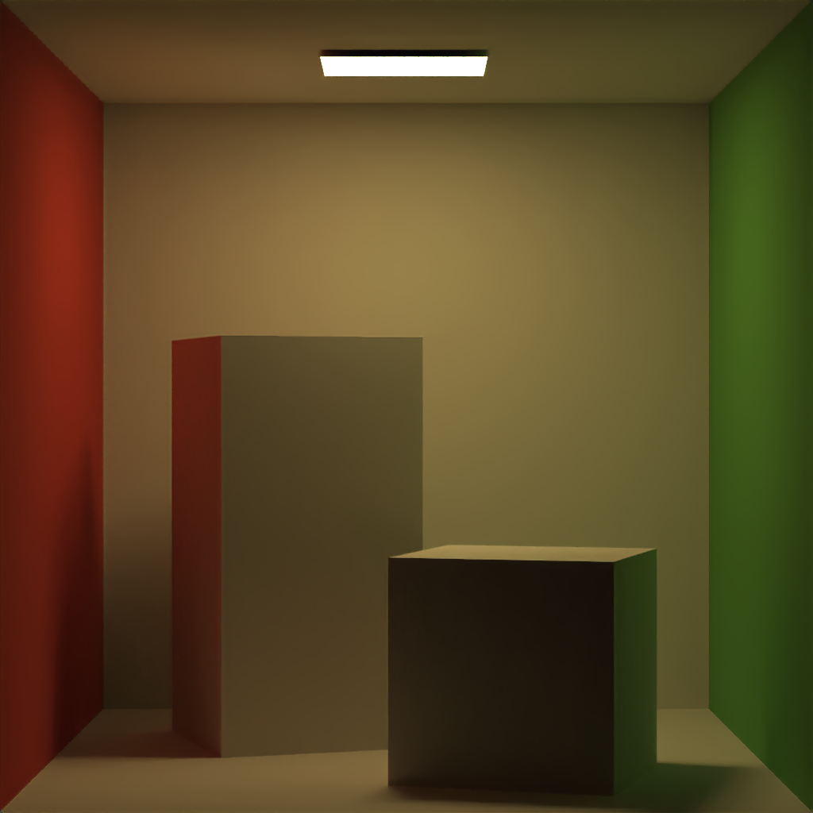
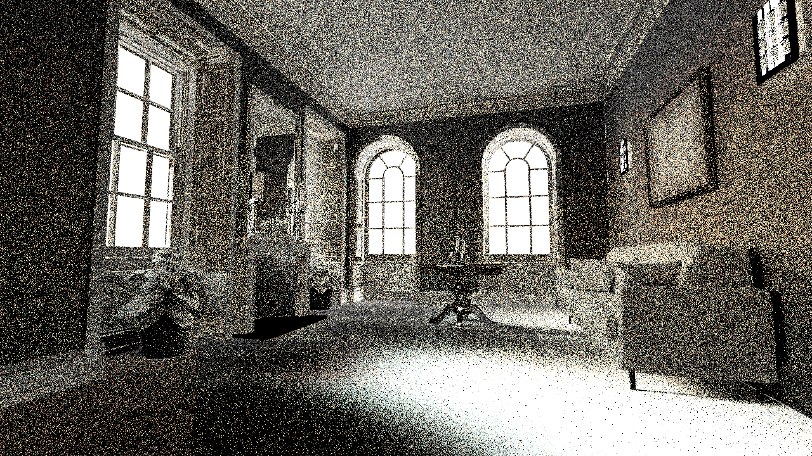
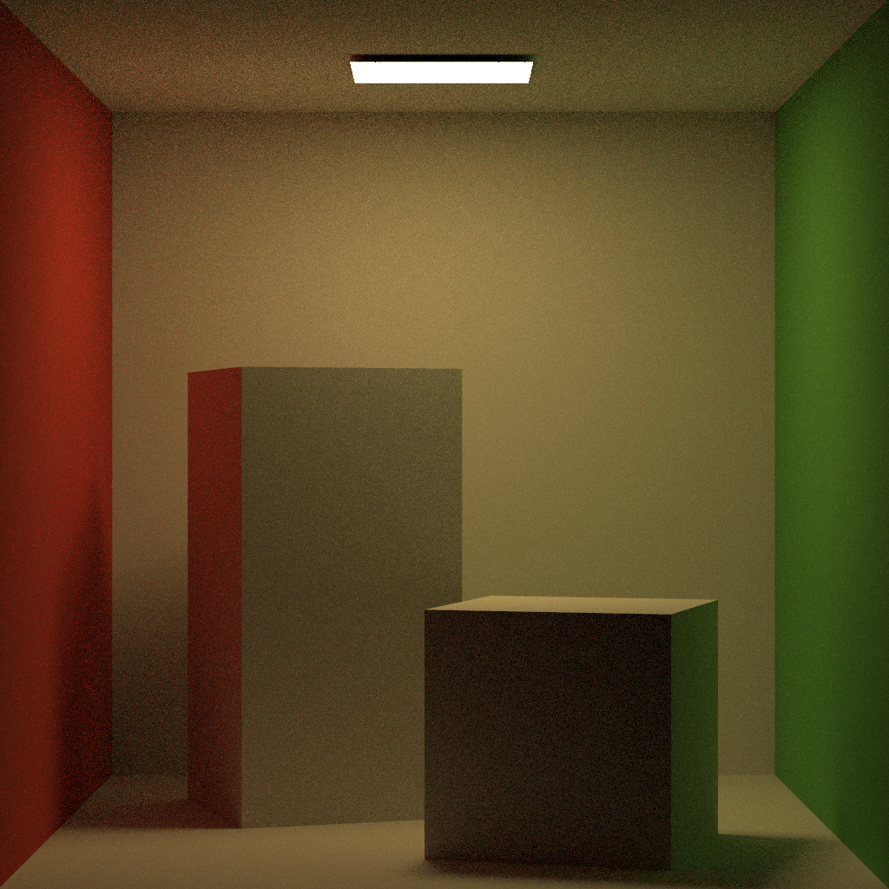
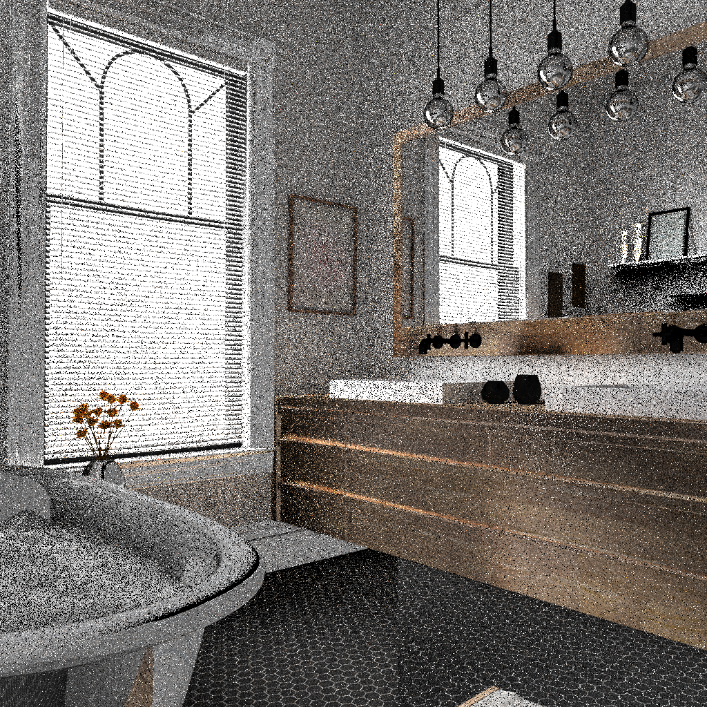
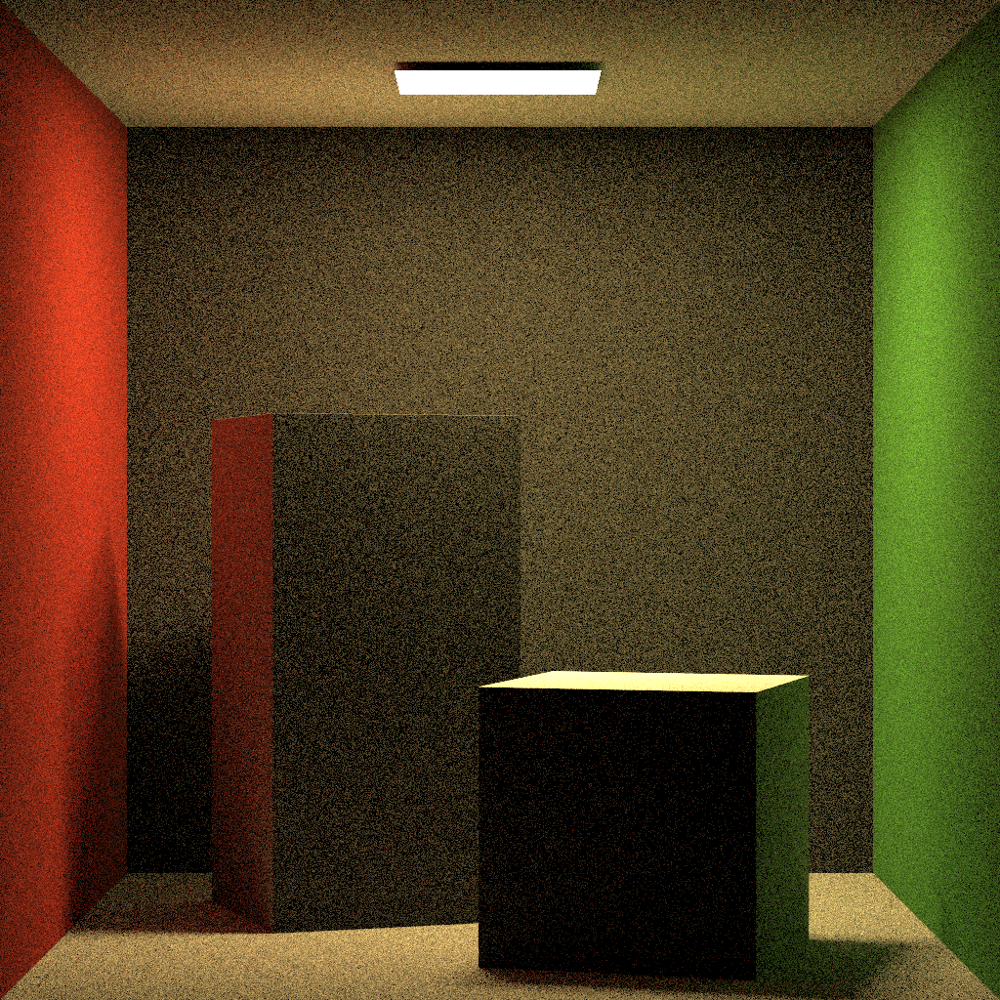

# RTBase

## Overview

This project contains the implementation of mutliple light transport algorithms, including light tracing, instant radiosity, primary space metropolis light transport. A BVH was used to optimisie ray intersection.

## Project Structure

```
Renderer/
│── Core.h               # Core mathematical and utility functions
│── Renderer.h           # Main ray tracing logic
│── Sampling.h           # Monte Carlo sampling utilities
│── Scene.h              # Scene representation and camera logic
│── SceneLoader.h        # Loads scenes and configurations
│── Lights.h             # Light source definitions
│── Geometry.h           # Geometric structures and operations
│── Imaging.h            # Image generation and storage
│── Materials.h          # Materials and shading models
│── GEMLoader.h          # External loader for scene assets
│── GamesEngineeringBase.h  # Base utilities for integration
```

## Scenes






  
https://github.com/charlescookey/RayTracer/blob/main/RTBase/images/GI2.png
